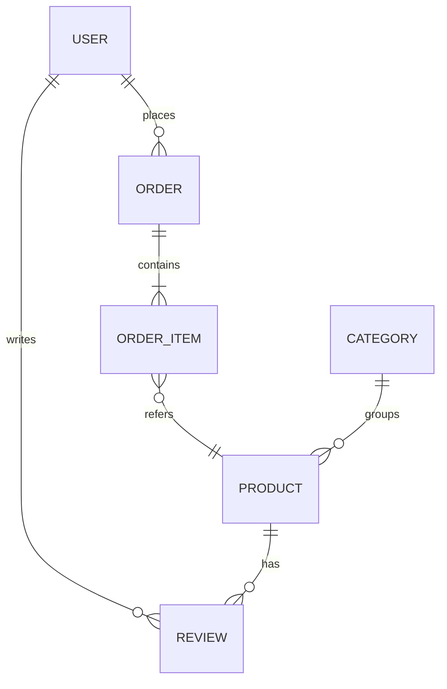

# {{站点名}} 产品需求文档（PRD）

> 基于对 {{origin}} 的分析生成 · {{日期}} · 依据 = **实采**（页面 / 请求里直接看到）或 **推断**（按规则由实采推出，需确认）
> 数据来源：`features/features.json`（`analyze_features.py` 产出）。本文档只到需求层，不含技术方案与后端设计。

## 1. 产品概述

| 项 | 内容 | 依据 |
|---|---|---|
| 一句话定位 | {{做什么、给谁用}} | 推断（据首页 h1 / description） |
| 站点类型 | {{ecommerce / content / saas / community}} | {{实采 / 推断}} |
| 核心价值 | {{用户为什么来}} | 推断 |
| 分析范围 | {{N}} 个页面：{{页面类型统计}}；登录墙后 {{M}} 页{{未采 / 已用用户账号采集}} | 实采 |
| 未覆盖 | {{未采到的部分：后台、登录后页面、支付回调…}} | — |

## 2. 目标用户与角色

| 角色 | 谁 | 能做什么（功能 ID） | 依据 | 来源 |
|---|---|---|---|---|
| 访客 | 未登录用户 | {{F001, F002…}} | 实采 | 所有未登录可访问页 |
| 注册用户 | | | {{实采 / 推断}} | {{登录墙 / 密码表单 / 收藏按钮}} |
| {{付费用户 / 会员}} | | | 推断 | {{文案「VIP」}} |
| {{商家}} | | | 推断 | |
| 管理员 | 后台运营 | 见 `admin-ia.md` | {{实采（有后台 URL）/ 推断}} | |

## 3. 核心用户旅程

每条旅程标出起点页与终点页；步骤带 `?` 的是推断（原站未采到，按常规产品逻辑补全）。

### 3.1 {{旅程名，如：浏览 → 筛选 → 详情 → 加购 → 下单}}

| 步骤 | 页面 | 用户动作 | 系统反馈 | 依据 |
|---|---|---|---|---|
| 1 | | | | 实采 |
| 2 | | | | 推断 |

### 3.2 {{旅程名}}

（重复 3.1 结构；一般 3–6 条：注册登录、核心浏览、核心交易 / 转化、内容产出、互动、客服）

## 4. 功能清单

按功能分类法分组（`references/feature-taxonomy.md`）。优先级 MoSCoW：Must = 没有它产品不成立；Should = 首版应有；Could = 增强；Won't = 本期明确不做。

### 4.1 {{模块：账户与认证}}

| ID | 功能点 | 描述 | 来源页面 / 元素 | 优先级 | 依据 |
|---|---|---|---|---|---|
| F001 | 登录 | 邮箱 + 密码；第三方登录（微信） | `login.html` form[action=/api/login] | Must | 实采 |
| F002 | 注册 | | | Must | 实采 |
| F003 | 找回密码 | | 未在前台见到入口 | Should | 推断 |

### 4.2 {{模块：内容浏览}}

| ID | 功能点 | 描述 | 来源页面 / 元素 | 优先级 | 依据 |
|---|---|---|---|---|---|

（每个有内容的模块一节；空模块不列）

## 5. 用户故事与验收标准

只为 Must 与 Should 写；每条故事至少两条可验证的验收标准（Given / When / Then 或清单式）。环境里有 `story-generator` 子代理时可用它扩写，再按本节表格合并。

### US-01 {{作为 <角色>，我想 <做什么>，以便 <价值>}}（对应 F00x）

- **验收 1**：Given … When … Then …
- **验收 2**：…
- **边界 / 异常**：空态、错误态、网络失败、权限不足时的表现
- 依据：{{实采 / 推断}}

### US-02 …

## 6. 页面清单

| 页面 | URL 模式 | 类型 | 主要内容 / 功能（ID） | 登录要求 | 依据 |
|---|---|---|---|---|---|
| 首页 | `/` | landing | | 否 | 实采 |
| 列表 | `/products?category=&sort=&page=` | list | | 否 | 实采 |
| 详情 | `/product?id=` | detail | | 否 | 实采 |
| 个人中心 | `/account` | account | 订单 / 收藏 / 资料 | 是 | 推断（前台有入口未采到） |

## 7. 数据实体与关系

属性后带 `?` 的是推断。

| 实体 | 属性（来源） | 关系 | 依据 |
|---|---|---|---|
| Product | id、name、price、rating、category、image、description（API `/api/products.json` 响应字段）；specs?（详情页规格表） | 属于 Category；有多条 Review | 实采 |
| User | name、email、phone、password（注册表单字段）；avatar?、createdAt? | | 实采 |
| Order | items、shipping、payment、coupon、note（结算表单）；status?、total? | 属于 User | 实采 + 推断 |

## 8. 非功能需求

| 类别 | 需求 | 依据 |
|---|---|---|
| 性能 | 列表首屏 < 2s；图片懒加载（原站{{有 / 无}}） | {{实采 / 推断}} |
| SEO | 每页独立 title / description；面包屑；JSON-LD（原站{{类型}}） | 实采 |
| 国际化 | {{语言：…；货币：…}} | 实采 |
| 无障碍 | 表单 label、图标按钮 aria-label、键盘可达 | 推断（行业基线） |
| 安全 | 密码强度、验证码（原站{{有 / 无}}）、支付走第三方 | {{实采 / 推断}} |
| 合规 | 隐私政策 / 服务条款页（原站{{有 / 无}}）；Cookie 提示 | 实采 |

## 9. 假设与待确认

| # | 假设 | 影响范围 | 需要谁确认 |
|---|---|---|---|
| 1 | 所有标「推断」的功能点、属性、流程步骤 | 全文 | 产品负责人 |
| 2 | 登录墙后的页面（个人中心、订单）按常规电商推断 | §4、§6、§7 | 有账号的用户 |
| 3 | 被拦截的写接口（{{POST /api/orders…}}）只知道请求字段，不知道响应与状态流转 | §7 Order.status | 后端 |
| 4 | 角色权限边界（会员 / 商家）仅据前台文案 | §2 | 业务方 |

## 10. 版权与合规声明

本文档分析的是 {{origin}} 的公开页面，用于 {{学习 / 自有站点重建 / 已授权复刻 / 竞品分析}}。功能与信息架构属于产品设计层面的分析；原站的文案、图片、品牌标识受版权保护，不在本文档复用范围内。采集过程默认拦截所有写请求，未在原站产生任何数据。
