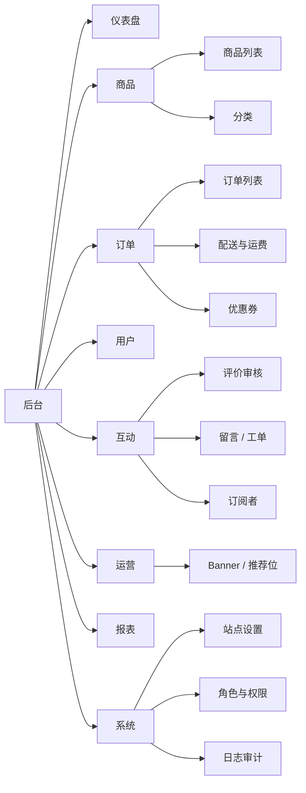
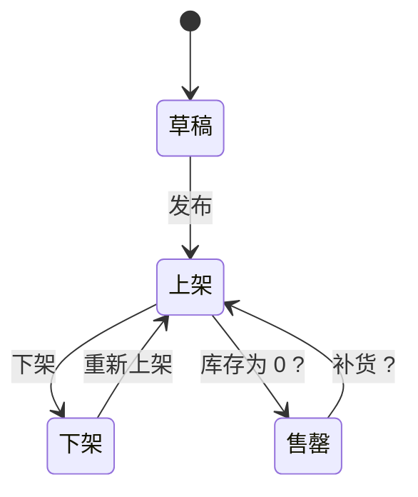

# {{站点名}} admin 功能信息架构

> 基于 {{origin}} · {{日期}} · 依据 = **实采**（用户提供了后台 URL / 截图，直接看到）或 **推断**（从前台实体与用户行为反推，规则见 `references/admin-inference.md`）
> {{本文档全部为推断 / 其中 X 个模块为实采}}。推断的后台是"支撑前台这些功能至少需要什么"，不是原站后台的真实形态。

## 1. 管理角色与权限矩阵

| 角色 | 职责 | 依据 |
|---|---|---|
| 超级管理员 | 全部模块、角色权限、站点设置 | 推断 |
| 运营 | 商品 / 内容 / Banner / 优惠券、报表查看 | 推断 |
| 客服 | 订单查看与备注、留言工单、用户查看 | 推断 |
| {{内容编辑}} | 文章 / 评论审核 | 推断 |

| 模块 | 超级管理员 | 运营 | 客服 | {{内容编辑}} | 依据 |
|---|---|---|---|---|---|
| 仪表盘 | 全部 | 查看 | 查看 | 查看 | 推断 |
| 商品管理 | 全部 | 全部 | 查看 | — | 推断 |
| 订单管理 | 全部 | 查看 | 查看 + 备注 + 改状态 | — | 推断 |
| 用户管理 | 全部 | 查看 | 查看 | — | 推断 |
| 评论审核 | 全部 | 全部 | — | 全部 | 推断 |
| 优惠券 | 全部 | 全部 | 查看 | — | 推断 |
| Banner / 推荐位 | 全部 | 全部 | — | — | 推断 |
| 站点设置 | 全部 | — | — | — | 推断 |
| 角色与权限 | 全部 | — | — | — | 推断 |
| 日志审计 | 全部 | — | — | — | 推断 |

## 2. 模块树

每个模块的依据在 §3 逐个标注。

## 3. 模块详情

每个模块按"列表 → 表单 → 操作 → 状态流转 → 依据"写。列表字段直接对应前台实体属性（`PRD.md` §7）；带 `?` 的字段是推断。

### 3.1 {{商品管理}}（实体：Product）

**列表**

| 字段 | 来源 | 依据 |
|---|---|---|
| 缩略图、名称、分类、价格、评分、标签、状态 | API `/api/products.json` 响应字段 | 实采（字段）+ 推断（放进后台列表） |
| 库存 ? | 详情页无库存信息 | 推断 |
| 创建 / 更新时间 ? | — | 推断 |

- 筛选：分类、状态、价格区间、关键词
- 排序：创建时间、价格、销量 ?
- 批量：上架 / 下架、删除、导出

**表单**

| 字段 | 类型 | 校验 | 依据 |
|---|---|---|---|
| 名称 | 文本 | 必填 | 实采 |
| 分类 | 单选（Category） | 必填 | 实采 |
| 价格 | 金额 | ≥ 0 | 实采 |
| 图片 / 图廊 | 多图上传 | 至少 1 张 | 实采（前台有 gallery） |
| 颜色 / 规格 | 可增删列表 | | 实采（前台色板） |
| 描述 | 富文本 | | 实采 |
| 规格参数 | 键值列表（光源 / 功率 / 色温 / 材质） | | 实采（详情页规格表） |
| 标签 | 多选 | | 实采 |
| 库存 ? | 整数 | ≥ 0 | 推断 |
| SEO 标题 / 描述 ? | 文本 | | 推断 |

**操作**：新建、编辑、复制 ?、上架 / 下架、删除（软删 ?）、预览前台

**状态流转**

依据：{{推断——由前台商品列表 / 详情反推；若有后台实采改为实采并写 URL}}

### 3.2 {{分类管理}}（实体：Category）

（列表：名称、slug、排序、商品数、状态；表单：名称、父级 ?、排序、封面 ?；操作：新建 / 编辑 / 排序 / 停用；依据：推断——前台筛选有分类）

### 3.3 {{订单管理}}（实体：Order）

（列表：订单号、用户、金额、商品数、支付方式、配送方式、状态、下单时间；筛选：状态 / 时间 / 支付方式 / 关键词；批量：导出、发货；详情：商品行、收货信息、支付信息、优惠、备注、操作日志 ?；操作：改状态、备注、退款 ?、打印面单 ?；状态：待支付 → 已支付 → 已发货 → 已完成 / 已取消 / 退款中 → 已退款；依据：实采（结算表单字段）+ 推断（状态与后台操作））

### 3.4 {{用户管理}}（实体：User）

（列表：ID、昵称、邮箱、手机、注册时间、最近登录 ?、订单数 ?、状态；筛选：状态 / 注册时间 / 关键词；操作：查看、编辑、禁用 / 启用、重置密码、导出；不显示密码；依据：实采（注册表单字段）+ 推断）

### 3.5 {{评价审核}}（实体：Review）

（列表：内容、评分、作者、所属商品、时间、状态；筛选：状态 / 评分 / 时间；批量：通过 / 拒绝；状态：待审核 → 已通过 / 已拒绝 → 已隐藏；依据：实采（前台评价列表与表单）+ 推断（是否需审核））

### 3.6 {{留言 / 工单}}（实体：Message）

### 3.7 {{订阅者}}（实体：Subscriber）

### 3.8 {{优惠券}}（实体：Coupon）

### 3.9 {{配送与运费}}

### 3.10 Banner / 推荐位

（列表：位置（首页 hero / 精选位）、标题、图片、链接、排期、排序、状态；依据：推断——前台首页有 hero 与精选区）

### 3.11 报表

（指标：访问、注册、订单数、GMV、转化率、热销商品、分类销量；维度：日 / 周 / 月、渠道；导出；依据：推断）

### 3.12 站点设置

（基本信息、联系方式、SEO 默认值、导航与页脚配置、多语言 / 货币、隐私政策 / 条款文本；依据：推断——前台有页脚分组 / 语言切换 / 法务页）

### 3.13 角色与权限

（管理员账号、角色、权限矩阵（§1）、登录方式、双因素 ?；依据：推断）

### 3.14 日志审计

（登录日志、敏感操作（删除 / 改价 / 改订单状态 / 退款）日志、导出；依据：推断）

## 4. 与前台的映射

| 前台功能（PRD ID） | 后台模块 | 后台要做的事 | 依据 |
|---|---|---|---|
| 列表 / 详情浏览 | 商品管理、分类管理 | 维护商品与分类 | 推断 |
| 加购 → 下单 | 订单管理、配送与运费、优惠券 | 处理订单、配置运费与优惠 | 推断 |
| 注册 / 登录 | 用户管理、角色与权限 | 用户与后台账号 | 推断 |
| 评价 | 评价审核 | 审核与隐藏 | 推断 |
| 联系表单 | 留言 / 工单 | 处理与回复 | 推断 |
| 订阅 | 订阅者 | 导出到邮件工具 | 推断 |
| 首页 hero / 精选 | Banner / 推荐位 | 排期与排序 | 推断 |
| 多语言 | 站点设置 | 翻译与开关 | 推断 |

## 5. 待确认

- 原站是否真的有后台，以及是自建还是用 Shopify / WooCommerce / Strapi 等（`features.json.pages` 中若有 `admin` 页或第三方平台标识，写在这里）
- 审核流程是否存在（评价 / 内容是否先审后发）
- 订单状态与退款流程的真实定义
- 报表口径
