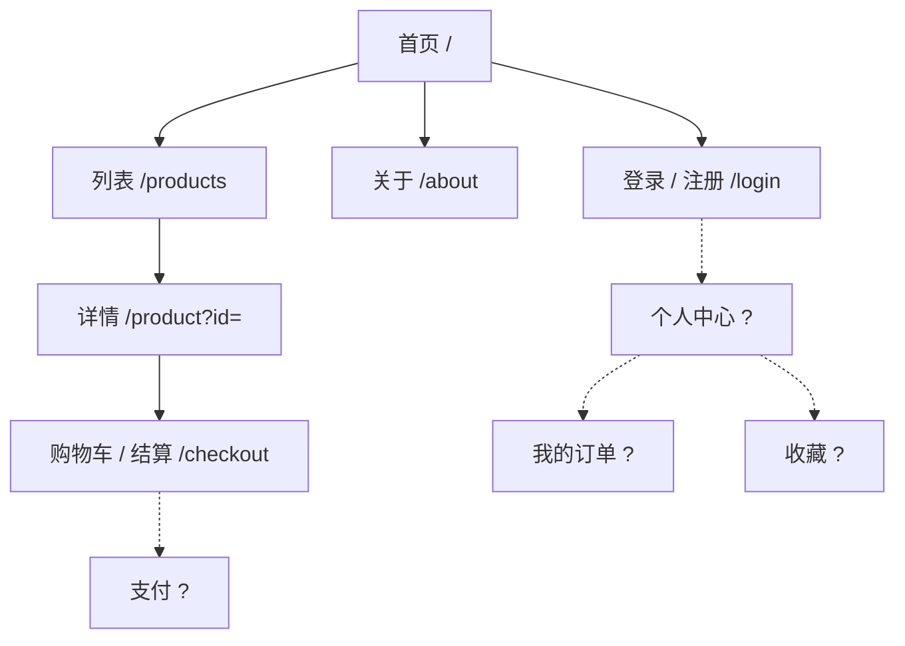
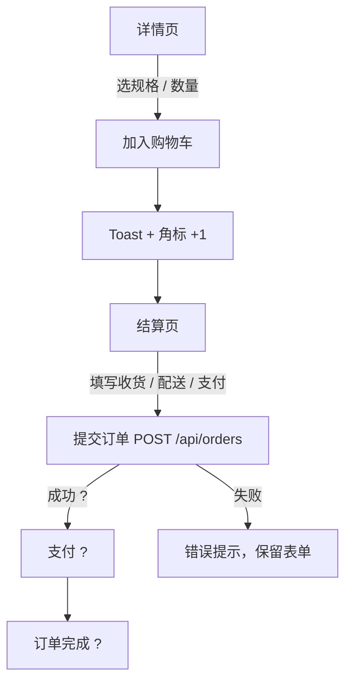

# {{站点名}} 前端功能信息架构

> 基于 {{origin}} · {{日期}} · 依据 = **实采** / **推断**（需确认）
> 配套：`PRD.md`（功能 ID 与优先级）、`admin-ia.md`。本文档描述前台"有什么页面、怎么组织、每页有什么、用户怎么走"，不含视觉规范（那是 `website-clone-visual` 的蓝图）。

## 1. 站点地图

虚线与 `?` = 推断页面（前台有入口但未采到，或按常规补全）。

## 2. 导航结构

### 2.1 全局 Header

| 项 | 目标 | 登录前 | 登录后 | 依据 |
|---|---|---|---|---|
| Logo | `/` | 显示 | 显示 | 实采 |
| 主导航：{{首页 / 全部灯具 / 吊灯 / 台灯 / 关于}} | | 显示 | 显示 | 实采 |
| 购物车（角标数量） | `/checkout` | 显示 | 显示 | 实采 |
| 登录 | `/login` | 显示 | 变为头像 / 账户菜单 ? | 实采 + 推断 |
| 语言切换 | | 显示 | 显示 | 实采 |

### 2.2 页脚

| 分组 | 链接 | 依据 |
|---|---|---|
| {{购物}} | | 实采 |
| {{帮助}} | | 实采 |
| {{账户}} | | 实采 |

### 2.3 面包屑 / 侧栏 / 移动端

- 面包屑：{{出现在哪些页，格式}}（{{实采 / 推断}}）
- 移动端导航：{{汉堡菜单 / 底部 Tab}}（{{实采 / 推断}}——功能采集不看视口，移动端形态多为推断）

## 3. 路由表

| 路由 | 页面 | 参数 | 登录 | 对应功能 ID | 依据 |
|---|---|---|---|---|---|
| `/` | 首页 | — | 否 | | 实采 |
| `/products` | 列表 | `category`、`sort`、`maxPrice`、`page`、`q` | 否 | | 实采（URL 参数由只读探测观察到） |
| `/product` | 详情 | `id` | 否 | | 实采 |
| `/login` | 登录 / 注册 | `#register`、`?redirect=` ? | 否 | | 实采 + 推断 |
| `/checkout` | 购物车 / 结算 | — | {{否 / 是}} | | 实采 |
| `/account` | 个人中心 | — | 是 | | 推断 |
| `/404` | 未找到 | — | 否 | | 推断 |

## 4. 每页信息架构

每页按"区块 → 内容与交互 → 状态"写。状态至少覆盖：**默认 / 空 / 加载中 / 错误 / 登录态差异**。

### 4.1 首页 `/`

| 区块 | 内容 | 交互 | 数据来源 | 依据 |
|---|---|---|---|---|
| Hero | 主标题、副标题、主 CTA、次 CTA | CTA → 列表 | 静态 / CMS ? | 实采 |
| 精选商品 | N 张卡片（图、名、价、评分、标签） | 卡片 → 详情 | `GET /api/products.json` | 实采 |
| 卖点 | 三列图文 | — | 静态 | 实采 |
| 订阅 | 邮箱输入 + 提交 | 提交 → 成功提示 ? | `POST /api/subscribe`（被拦截，只知字段） | 实采 + 推断 |

| 状态 | 表现 | 依据 |
|---|---|---|
| 加载中 | 卡片骨架 ? | 推断 |
| 空 | 无精选时隐藏区块 ? | 推断 |
| 错误 | 接口失败显示重试 ? | 推断 |
| 登录后 | Header 变化，其余相同 | 推断 |

### 4.2 列表 `/products`

| 区块 | 内容 | 交互 | 数据来源 | 依据 |
|---|---|---|---|---|
| 筛选侧栏 | 分类单选（{{选项}}）、价格上限滑块 | 改变即刷新列表并写入 URL | 前端过滤 / API 参数 ? | 实采 |
| 工具栏 | 搜索框、排序下拉（{{选项}}）、结果数 | 即时过滤 | | 实采 |
| 卡片网格 | 每页 N 个 | 卡片 → 详情；加购 ? | | 实采 |
| 分页 | 上一页 / 页码 / 下一页 | URL `page=` | | 实采 |

| 状态 | 表现 | 依据 |
|---|---|---|
| 空 | "没有匹配的商品" + 清空筛选 | {{实采 / 推断}} |
| 加载中 | | 推断 |

### 4.3 详情 `/product?id=`

（区块：面包屑、图廊、标题 / 价格 / 评分、规格选择、数量、加购 / 收藏、Tab（规格 / 评价 / 配送）、评价列表与评价表单、推荐 ?；状态：404 商品、售罄 ?、未登录点收藏 → 跳登录 ?）

### 4.4 登录 / 注册 `/login`

（区块：登录表单（字段、校验、第三方登录）、注册表单（字段、协议勾选）、切换 Tab；状态：校验错误、提交失败、成功后回跳 ?）

### 4.5 购物车 / 结算 `/checkout`

（区块：商品行（数量 / 移除）、收货信息、配送方式、支付方式、优惠码、金额汇总、提交订单；状态：空车、库存不足 ?、优惠码无效、提交失败）

### 4.6 {{其他页}}

## 5. 全局组件

| 组件 | 出现位置 | 行为 | 依据 |
|---|---|---|---|
| Header / Footer | 全部页 | 见 §2 | 实采 |
| Toast / 提示 | 加购、订阅、表单提交后 | 3s 自动消失 ? | {{实采 / 推断}} |
| 弹窗 / 抽屉 | {{购物车抽屉 / 登录弹窗}} | | {{实采 / 推断}} |
| 空态 / 错误态 | 列表、搜索、404 | 插图 + 文案 + 操作 | 推断 |
| 加载态 | 列表 / 详情 | 骨架屏 | 推断 |
| Cookie / 隐私提示 | 首次访问 | | {{实采 / 推断}} |
| 语言切换 | Header | 切换后保持当前页 | 实采 |

## 6. 主流程图

### 6.1 {{加购 → 下单}}

### 6.2 {{注册 / 登录}}

### 6.3 {{搜索 → 结果 → 详情}}

（每条主流程一张图；`?` 标推断分支）

## 7. 登录态与权限矩阵（前台）

| 页面 / 功能 | 访客 | 注册用户 | {{会员}} | 依据 |
|---|---|---|---|---|
| 浏览列表 / 详情 | ✓ | ✓ | ✓ | 实采 |
| 加入购物车 | ✓（本地） | ✓ | ✓ | 实采 |
| 收藏 | → 登录 ? | ✓ | ✓ | 推断 |
| 发表评价 | → 登录 ? | ✓ | ✓ | 推断 |
| 结算下单 | {{✓ / → 登录}} | ✓ | ✓ | {{实采 / 推断}} |
| 个人中心 | ✗ | ✓ | ✓ | 推断 |

## 8. 待确认

- {{推断页面的存在性：个人中心、订单列表、收藏列表}}
- {{移动端导航形态}}
- {{各状态（空 / 错误 / 加载）的原站表现——功能采集只看默认态}}
